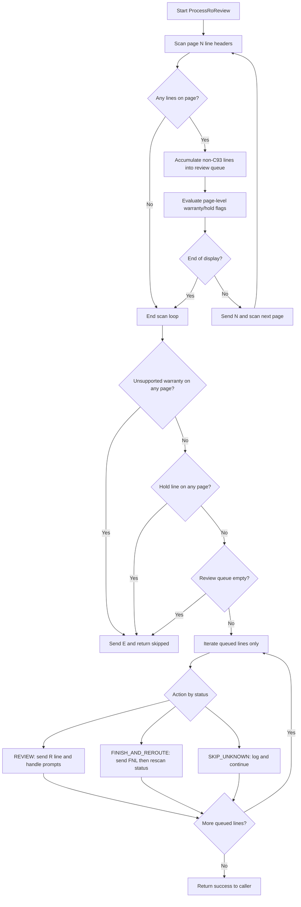

# Maintenance RO Closer — Business Rules and Gate Precedence

## Overview
The script applies **RO-level business gates first** (blacklist, age override, READY TO POST), then enters `ProcessRoReview` where it **scans all pages before acting** and applies review-phase gates (unsupported warranty type, hold detection, all-C93 optimization).

---

## Exact Decision Flow (Complete Ordering)

**PHASE 1: RO-Level Eligibility Gates** (before entering review flow, evaluated in order):

```
┌─ Gate 1: Blacklist Check
│  IF RO in SkipRoList THEN
│     SKIP and EXIT (cannot override, even by age exception)
│  END IF
│
├─ Gate 2: Age Exception (OVERRIDES Gate 3)
│  IF RO age >= 30 days THEN
│     PROCESS and EXIT (process old ROs regardless of READY TO POST status)
│  END IF
│
├─ Gate 3: READY TO POST Status
│  IF screen contains "READY TO POST" THEN
│     PROCESS
│  END IF
│
└─ Gate 4: Default Fallback
   ELSE
      SKIP
   END IF
```

**PHASE 2: ProcessRoReview Scan + Review-Phase Gates** (inside `ProcessRoReview`, after all-page scan):

```
┌─ Gate A: Unsupported Warranty Labor Type (any scanned page)
│  IF unsupported W* type is detected THEN
│     SKIP REVIEW and EXIT ProcessRoReview
│  END IF
│
├─ Gate B: Hold Detection (any scanned page)
│  IF ANY scanned line is Hxx THEN
│     SKIP REVIEW and EXIT ProcessRoReview
│  END IF
│
└─ Gate C: All Scanned Lines Already Reviewed
   IF review queue is empty after all-page scan (all C93) THEN
      SKIP REVIEW and EXIT ProcessRoReview
   END IF

[If both gates pass, proceed to per-line processing]
```

**PHASE 3: Per-Line Processing** (for each line that passed phases 1-2):

```
├─ IF line status = C92 THEN → REVIEW
├─ IF line status = C93 THEN → SKIP_REVIEWED
├─ IF line status starts with I THEN → FINISH_AND_REROUTE
├─ IF line status starts with H THEN → Should not reach (caught by Line Gate 2)
└─ OTHERWISE → SKIP_UNKNOWN
```

---

## Gate Precedence (RO-Level) — Ordered by Evaluation

### Gate 1: Blacklist (SkipRoList.csv)
**Evaluation Order:** 2nd
**Priority:** ABSOLUTE — cannot be overridden, NOT EVEN by age exception
- **Rule:** If RO is in SkipRoList
- **Action:** Skip and EXIT function immediately
- **Log:** `"RO ... found in SkipRoList. Skipping before entry."`
- **Rationale:** User-maintained manual exclusion list; most powerful filter
- **Overrides:** Nothing (this gate cannot be overridden)
- **Overridden By:** Nothing
- **Critical Note:** Even if RO is 500 days old, blacklist BLOCKS it

---

### Gate 2: Age Exception (≥30 days)
**Evaluation Order:** 3rd (BEFORE READY TO POST)
**Priority:** HIGH — overrides normal status requirements
- **Rule:** If RO age ≥ `OLD_RO_DAYS_THRESHOLD` (default: 30 days)
- **Action:** Process and EXIT function immediately (skip Gate 3)
- **Log:** `"Age exception: ... days old (threshold: 30). Proceeding regardless of status."`
- **Rationale:** Business rule to clean up old stuck ROs
- **Overrides:** Gate 3 (READY TO POST check) — old ROs process even if NOT ready
- **Overridden By:** Gate 0, Gate 1 (cannot override unsupported labor or blacklist)

---

### Gate 3: READY TO POST Status
**Evaluation Order:** 4th (only evaluated if Gate 2 doesn't apply)
**Priority:** NORMAL — standard operational requirement
- **Rule:** If RO status is "READY TO POST"
- **Action:** Process
- **Log:** `"READY TO POST. Proceeding."`
- **Rationale:** Default eligibility check
- **Overrides:** Nothing (this gate has no override power)
- **Overridden By:** Gate 2 (age exception) — if RO is old, this gate is skipped

---

### Gate 4: Default Fallback
**Evaluation Order:** 5th (fallback if none above match)
**Priority:** N/A
- **Rule:** If RO fails all above gates
- **Action:** Skip
- **Log:** `"Not READY TO POST and age threshold not met. Skipping."`
- **Rationale:** Safety default — only process ROs matching known conditions

---

## Complete Gate Precedence (All Phases)

| Phase | Gate | Order | Condition | Action | Overrides | Can Be Overridden By |
|-------|------|-------|-----------|--------|-----------|---------------------|
| RO | 1 | 1st | Blacklist (SkipRoList) | Skip + EXIT | — | None (absolute, even age exception) |
| RO | 2 | 2nd | Age ≥ 30 days | Process + EXIT | Gate 3 (READY TO POST) | Gate 1 |
| RO | 3 | 3rd | READY TO POST | Process | — | Gate 2 (age exception skips this) |
| RO | 4 | 4th | Default | Skip | — | — |
| Review | A | 5th | Unsupported warranty labor type on any page | Skip review + EXIT | Remaining review actions | None (review-phase absolute) |
| Review | B | 6th | Any line Hxx on any page | Skip review + EXIT | Remaining review actions | None (review-phase absolute) |
| Review | C | 7th | Review queue empty after all-page scan (all C93) | Skip review + EXIT | Remaining review actions | None (review-phase absolute) |

---

## Gate Precedence (RO-Level) — Ordered by Evaluation

---

## Line-Level Gates (Within ProcessRoReview) — Checked FIRST, No Matter What

Once an RO passes RO-level gates and enters `ProcessRoReview()`, **line status is checked immediately before any other processing**. If all work is done or impossible, exit immediately:

### Line Gate 1: All Lines Already Reviewed (C93)
**Evaluation Order:** 1st in ProcessRoReview (immediate check)
**Priority:** HIGHEST — if all work is done, nothing else matters
- **Rule:** If ALL visible lines have status "C93" (already reviewed)
- **Action:** Skip entire review phase and exit RO with `E` (do not finalize)
- **Log:** `"All lines are C93 (already reviewed). Skipping entire RO."`
- **Rationale:** No review work needed and no additional review/finalization actions are required
- **Why First:** If all lines C93, there's nothing to review — skip everything
- **Efficiency Benefit:** Avoids wasted terminal interactions for already-done work

---

### Line Gate 2: Hold Detection (Any Line Hxx)
**Evaluation Order:** 2nd in ProcessRoReview (if not all C93)
**Priority:** VERY HIGH — cannot proceed if lines on hold
- **Rule:** If ANY line has status starting with "H" (hold)
- **Action:** Skip entire RO; exit ProcessRoReview immediately
- **Log:** `"Line ... is on hold (...). Skipping entire RO."`
- **Rationale:** Lines on hold cannot be reviewed; must wait for hold to clear
- **Why Second:** Check for blocks before attempting review work

---

## Line Status-to-Action Mapping

Once ProcessRoReview runs (after RO-level gates pass), individual lines are processed based on their status code:

| Status | Pattern | Action | Log |
|--------|---------|--------|-----|
| C92 | Exact match | REVIEW | Send "R \<line>" and handle prompts |
| C93 | Exact match | SKIP_REVIEWED | Mark as processed; do not review |
| Ixx | Starts with "I" | FINISH_AND_REROUTE | Send "FNL \<line>", re-read status, re-route based on new status |
| Hxx | Starts with "H" | SKIP_RO_ON_HOLD | Skip entire RO (should be caught by Line Gate 1) |
| Other | Unknown | SKIP_UNKNOWN | Skip line and log warning |

---

## Designed Behavior: Exception + Line Gate Optimization

### Scenario
```
Age Exception (Gate 2):
   "RO is 316 days old -> PROCESS regardless of READY TO POST status"
    ↓
Line Gate 2 (All-Reviewed):
   "All lines are C93 (already reviewed) → Skip re-review and exit"
```

### Outcome (INTENDED DESIGN)
- Exception says: "This old RO must be processed"
- Line gate says: "Lines are already reviewed (C93), so skip redundant review work"
- **Result:** Review phase exits without re-reviewing C93 lines (efficient)

### Why This Is Correct
1. **C93 = Already Reviewed:** Re-reviewing C93 lines wastes time and terminal interactions
2. **Age Exception Purpose:** Process old ROs that are stuck/forgotten, not to force re-review
3. **Optimization:** If all lines are done (C93), jump to finalization step (F/Y sequence)
4. **Production Behavior:** Logs show successful closures with this approach (ROs 807231, 810245, 835900, 843321, 843593, 843602, 872458)

### Exception Override Hierarchy
```
Age Exception OVERRIDES: READY TO POST status gate
Age Exception DOES NOT OVERRIDE: 
  - Blacklist (SkipRoList)
  - Hold detection (Hxx lines)
  - Warranty labor type validation

Line Gate 2 OPTIMIZES: Skips review if all lines C93
Line Gate 2 ALWAYS BLOCKS: If any line is Hxx (hold)
```

---

## Design Principle

**Exception = "Process this RO"**
- Overrides normal status checks (READY TO POST)
- Does NOT mean "re-review everything"
- Works with line-level gates to optimize work

**Line Gate 2 = "All lines done, skip redundant review"**
- Applies to ALL ROs (exception or not)
- Skips the review prompt loop and exits review phase
- Reduces unnecessary terminal interactions and time

**Combined Effect:** Old stuck ROs with all-reviewed lines are exited from review efficiently without redundant terminal work.

---

## Process Flow Diagram (Current)



Notes:
- Review actions run only for queued non-C93 lines captured during all-page scan.
- Unsupported warranty and hold checks are review-phase gates evaluated across scanned pages.
